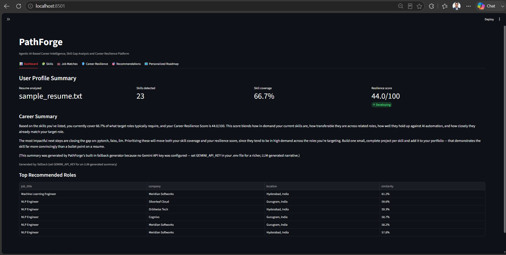
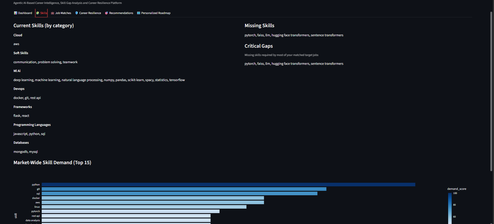
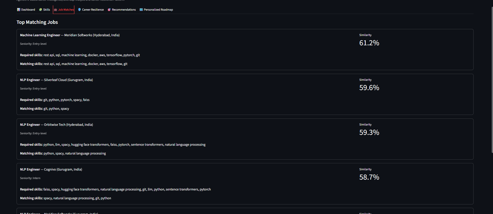
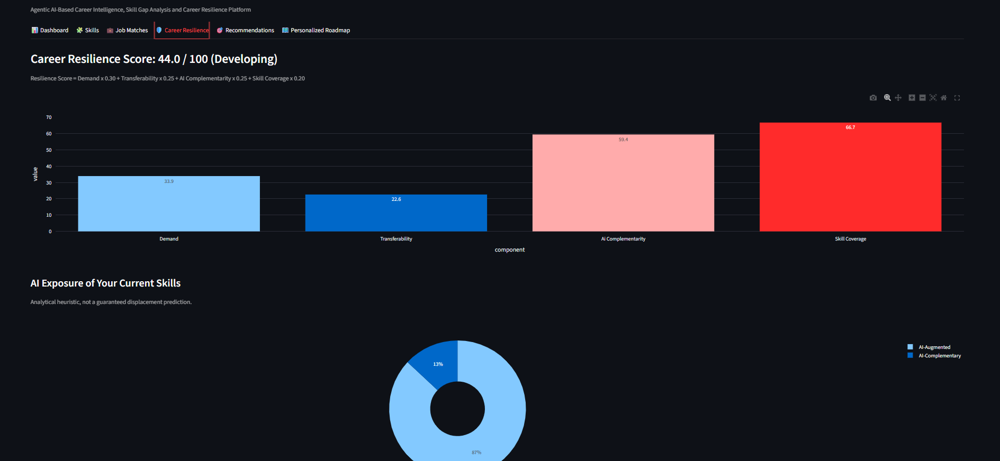
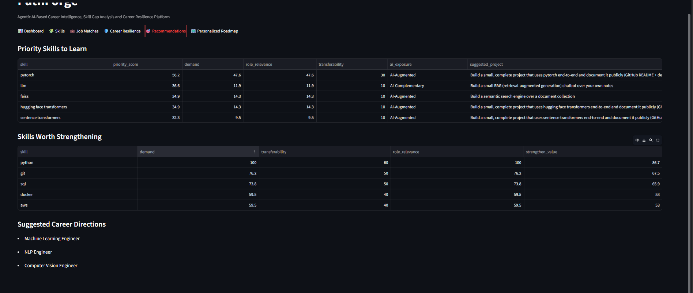
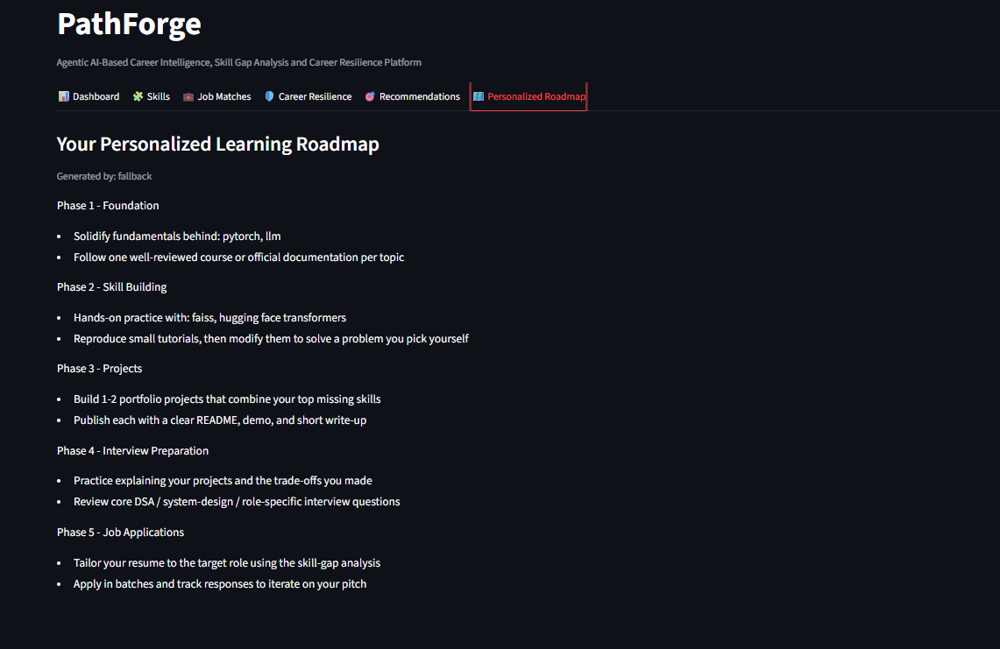

# PathForge

### Agentic AI-Based Career Intelligence, Skill Gap Analysis & Career Resilience Platform

PathForge is an AI-powered career intelligence platform that analyzes a candidate's resume against technology job requirements, identifies skill gaps, evaluates AI-era career resilience, and generates a personalized learning roadmap.

Unlike traditional keyword-based career tools, PathForge combines NLP, semantic search, market skill analysis, explainable scoring, and Generative AI to turn a resume into an actionable career plan.

---

## 🚀 Live Demo

[Open PathForge](https://pathforge-gc8cmfvfbxstcwb2z4ksbo.streamlit.app/)

---

## Problem Statement

The rapid adoption of Artificial Intelligence is changing the technology workforce and reshaping the skills demanded by industry. Traditional career platforms mainly rely on keyword-based job matching and often overlook critical skill gaps, market demand, skill transferability, and the potential impact of AI on different capabilities.

PathForge addresses this problem by helping users understand:

- What skills they already have
- Which skills are missing for relevant roles
- Which skills are in higher market demand
- How transferable their skills are across roles
- Which capabilities are more exposed or complementary to AI
- What they should learn and build next

---

## Key Features

- **Resume Analysis** — Upload PDF/TXT resumes with automatic text extraction and cleaning.
- **NLP Skill Extraction** — Extracts and normalizes technical skills using spaCy and rule-based matching.
- **Semantic Job Matching** — Uses Sentence Transformers and FAISS to retrieve relevant jobs beyond exact keyword matching.
- **Skill Gap Analysis** — Calculates skill coverage, missing skills, and critical gaps.
- **Market Demand Analysis** — Identifies frequently requested skills from the available job dataset.
- **Skill Transferability** — Estimates how broadly a skill applies across related roles.
- **AI Exposure Analysis** — Categorizes skills as AI-substitutable, AI-augmented, or AI-complementary using configurable heuristics.
- **Career Resilience Score** — Produces an explainable 0–100 indicator from documented weighted components.
- **Recommendations** — Ranks skills to learn, skills to strengthen, projects, and career directions.
- **Gemini Career Guidance** — Generates personalized career summaries and a five-phase roadmap when a Gemini API key is available.
- **Fallback Mode** — The application remains functional without Gemini or internet access.
- **Interactive Dashboard** — Six-section Streamlit interface for exploring results.

---

## Architecture

```text
Resume / Profile
       ↓
PDF / Text Extraction
       ↓
Text Cleaning
       ↓
NLP Skill Extraction
       ↓
Skill Normalization
       ↓
Candidate Skill Profile
       ↓
Sentence Embeddings
       ↓
FAISS Semantic Search
       ↓
Relevant Job Retrieval
       ↓
Skill Gap Analysis
       ↓
Market Demand + Transferability
       ↓
AI Exposure Analysis
       ↓
Career Resilience Score
       ↓
Recommendation Engine
       ↓
Gemini / Fallback Narrative
       ↓
Personalized Learning Roadmap
       ↓
Streamlit Dashboard
```

Detailed architecture: `docs/architecture.md`

---

## Technology Stack

**Languages & Data**
- Python
- Pandas
- NumPy

**Machine Learning & NLP**
- Scikit-learn
- spaCy
- Sentence Transformers
- FAISS

**Generative AI**
- Google Gemini API

**Application**
- Streamlit
- Plotly

**Testing**
- Pytest

**Development**
- Git
- GitHub

---

## Project Structure

```text
PathForge/
├── app.py
├── README.md
├── SETUP.md
├── requirements.txt
├── .env.example
├── .streamlit/
│   └── config.toml
│
├── data/
│   ├── jobs.csv
│   ├── skills.json
│   ├── ai_exposure_rules.json
│   ├── generate_sample_jobs.py
│   └── ingest_real_dataset.py
│
├── models/
├── notebooks/
├── src/
├── tests/
├── sample_data/
├── assets/
└── docs/
```

---

## Installation

### 1. Clone the repository

```bash
git clone https://github.com/2k24csaiml1e2411265-wq/PathForge.git
cd PathForge
```

### 2. Create a virtual environment

**Windows**

```bash
python -m venv venv
venv\Scripts\activate
```

**Linux / macOS**

```bash
python -m venv venv
source venv/bin/activate
```

### 3. Install dependencies

```bash
pip install -r requirements.txt
```

### 4. Install the spaCy model

```bash
python -m spacy download en_core_web_sm
```

### 5. Start the application

```bash
streamlit run app.py
```

---

## Dataset

The repository includes an **80-row synthetic demonstration dataset** containing technology job postings.

The sample dataset is intentionally included for reproducibility and demonstration. It is **not** a scraped or licensed 6,520-row production dataset.

To use a larger authorized dataset, use `data/ingest_real_dataset.py`.

The sample dataset can be regenerated using `data/generate_sample_jobs.py`.

---

## Gemini API

Gemini is an optional intelligence layer.

Create a `.env` file from `.env.example`:

```env
GEMINI_API_KEY=your_api_key_here
```

Without an API key, PathForge automatically uses its local fallback generator for career summaries and roadmaps.

The core skill extraction, semantic search, skill-gap analysis, and resilience scoring do not depend on Gemini.

> **Security:** Never commit `.env` or any real API key to GitHub.

---

## Offline Support

PathForge includes fallbacks for environments with limited connectivity:

- Sentence Transformers → TF-IDF fallback
- FAISS → Scikit-learn Nearest Neighbors fallback
- Gemini → Local template-based recommendation fallback

---

## Example Workflow

1. Upload a resume or use the sample resume.
2. Select a target role or allow automatic matching.
3. Click **Analyze Profile**.
4. Review extracted skills.
5. Explore matching job opportunities.
6. Review missing and critical skills.
7. Check market demand and career resilience.
8. Review recommended skills and projects.
9. Generate a personalized learning roadmap.

---

## Results

PathForge provides:

- Current skill profile
- Skill coverage percentage
- Relevant job matches
- Missing and critical skills
- Market demand signals
- Skill transferability
- AI exposure classification
- Career resilience indicator
- Prioritized recommendations
- Personalized learning roadmap

### Application Screenshots

#### Dashboard


#### Skills Analysis


#### Job Matches


#### Career Resilience


#### Recommendations


#### Learning Roadmap


---

## Evaluation

Run the automated tests:

```bash
python -m pytest tests -v
```

The current automated suite contains **22 passing tests** covering resilience scoring, semantic search, skill extraction/normalization, and skill-gap analysis.

For the evaluation workflow, see `docs/evaluation.md`.

---

## Limitations

- The included job dataset is synthetic and limited to 80 postings.
- Semantic search quality depends on the selected embedding model and available data.
- TF-IDF fallback is simpler than transformer-based semantic embeddings.
- AI-exposure classification is a heuristic and is not a validated economic forecast.
- Career resilience scores are analytical indicators, not guarantees of future employment outcomes.
- Gemini narrative quality depends on API availability and model behavior.

---

## Future Scope

- Integrate a larger authorized real-world job dataset.
- Add GitHub profile and project analysis.
- Expand the skill ontology and role taxonomy.
- Build a knowledge graph connecting skills, roles, projects, and learning resources.
- Add authentication and persistent candidate profiles.
- Evaluate and calibrate resilience-score weights using real career outcome data.
- Deploy the platform as a scalable cloud application.

---

## License

MIT License — see `LICENSE` for details.
